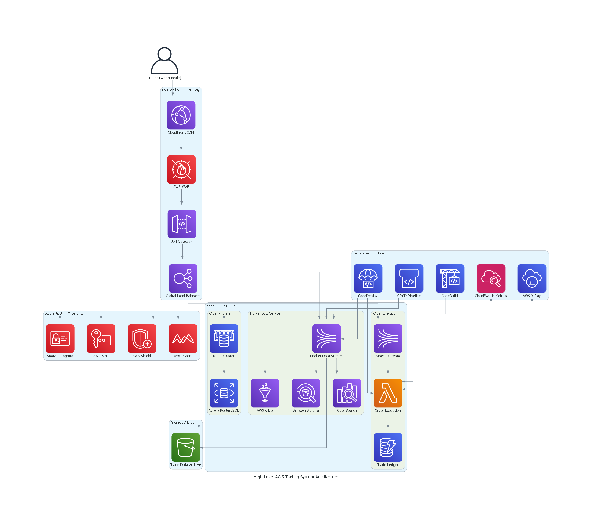

# 99Tech Trading System Infrastructure

This repository contains the Terraform code for deploying and managing the 99Tech Trading System infrastructure on AWS.

## Architecture Overview



> **Important Note:** This repository currently implements the foundational infrastructure components only. While the architecture diagram shows the complete trading system design, this initial implementation focuses on establishing the core infrastructure building blocks.

### Currently Implemented Components:
- Basic networking with VPC and multi-AZ subnets
- Initial EKS cluster setup for future microservices
- Basic ALB configuration for traffic routing
- Core database infrastructure (Aurora PostgreSQL and Redis)
- Essential monitoring with CloudWatch, AWS Config, and Security Hub

### Planned Future Components:
As the trading services are developed, the infrastructure will be expanded to include:

**Frontend & API Layer**
- CloudFront CDN for static content delivery
- API Gateway integration
- Global Load Balancer setup
- WAF configuration

**Authentication & Security**
- Cognito user management
- Advanced security with AWS Shield
- KMS encryption management
- Macie for data security

**Trading System Core**
- Order processing system with Redis matching engine
- Order execution system using Lambda
- Market data services with Kinesis streams
- Trade ledger using DynamoDB
- Analytics pipeline (Glue, Athena, OpenSearch)

**DevOps & Observability**
- CI/CD pipeline (CodePipeline, CodeBuild, CodeDeploy)
- Enhanced monitoring with X-Ray
- Comprehensive logging system

**Data Management**
- S3 data archival system
- Market data storage and processing

This phased approach allows us to establish a solid foundation while maintaining the flexibility to scale and adapt as trading services are developed and deployed.

Key components:
- VPC with public and private subnets across 3 AZs
- Amazon EKS cluster with private worker nodes
- Application Load Balancer (ALB) for traffic distribution
- Aurora PostgreSQL cluster (Multi-AZ) for persistent storage
- Redis ElastiCache cluster for caching
- CloudWatch monitoring and logging
- AWS Config and Security Hub for compliance

## Repository Structure

```
├── modules/
│   ├── vpc/             # VPC and networking
│   ├── eks/             # EKS cluster and node groups
│   ├── alb/             # Application Load Balancer
│   ├── database/        # Aurora PostgreSQL and Redis
│   └── monitoring/      # CloudWatch, Config, Security Hub
├── environments/
│   ├── dev/            # Development environment
│   ├── staging/        # Staging environment
│   └── prod/           # Production environment
├── versions.tf         # Provider versions
├── provider.tf         # Provider configuration
├── variables.tf        # Common variables
├── outputs.tf          # Common outputs
└── backend.tf          # Terraform backend configuration
```

## Prerequisites

1. AWS CLI configured with appropriate credentials
2. Terraform 1.0 or later
3. kubectl installed
4. SSL certificate in AWS Certificate Manager
5. S3 bucket and DynamoDB table for Terraform state (created automatically)

## Getting Started

1. Clone this repository
2. Navigate to the environment directory you want to deploy:
   ```bash
   cd terraform/environments/dev
   ```

3. Initialize Terraform:
   ```bash
   terraform init
   ```

4. Review the terraform.tfvars file and update the values as needed:
   - certificate_arn: ARN of your SSL certificate
   - alert_email: Email address for CloudWatch alerts

5. Plan the deployment:
   ```bash
   terraform plan
   ```

6. Apply the changes:
   ```bash
   terraform apply
   ```

## Module Documentation

### VPC Module
- Creates a VPC with CIDR block 10.0.0.0/16
- Public and private subnets across 3 AZs
- NAT Gateways for private subnet internet access
- VPC Flow Logs enabled

### EKS Module
- Creates an EKS cluster with private endpoint
- Managed node groups with auto-scaling
- IRSA enabled for pod IAM roles
- Core add-ons: CoreDNS, kube-proxy, VPC CNI

### ALB Module
- Application Load Balancer in public subnets
- HTTPS listener with SSL certificate
- HTTP to HTTPS redirect
- Access logs enabled

### Database Module
- Aurora PostgreSQL cluster with Multi-AZ
- Redis ElastiCache cluster for caching
- Encrypted storage and backups
- Private subnet placement

### Monitoring Module
- CloudWatch logs and metrics
- AWS Config with CIS benchmark rules
- Security Hub enabled
- CloudWatch alarms with SNS notifications

## Security

- All resources are deployed in private subnets where possible
- Security groups limit access to necessary ports only
- Encryption enabled for data at rest and in transit
- Regular security assessments via AWS Security Hub
- Compliance monitoring with AWS Config

## Cost Optimization

- Auto-scaling enabled for EKS nodes
- Multi-AZ deployment for high availability
- S3 lifecycle rules for log storage
- Right-sized instances based on workload

## Maintenance

1. Updating EKS version:
   - Update cluster_version in terraform.tfvars
   - Run terraform plan and apply

2. Scaling worker nodes:
   - Adjust min_size, max_size, and desired_size in eks module
   - Run terraform plan and apply

3. Backup and restore:
   - Aurora automated backups enabled
   - Manual snapshots recommended before major changes

## Scaling Plans

As the trading system grows, the infrastructure will need to scale accordingly. Here's our planned scaling strategy:

### Phase 1: Regional Scaling
Currently implemented foundation can handle initial growth through:
- EKS cluster auto-scaling (currently configured)
- Aurora PostgreSQL read replicas
- Redis ElastiCache cluster expansion
- ALB scaling based on demand

### Phase 2: Performance Optimization
When reaching ~1000 requests/second:
- Implement Redis cluster mode for the matching engine
- Add Aurora PostgreSQL read replicas
- Configure ALB target group scaling
- Optimize EKS node groups with spot instances
- Implement horizontal pod autoscaling (HPA)

### Phase 3: Multi-Regional Expansion
When requiring global presence:
- Deploy to multiple AWS regions
- Implement Route 53 with latency-based routing
- Set up CloudFront for static content
- Configure cross-region Aurora Global Database
- Implement DynamoDB global tables
- Set up regional Redis clusters

### Phase 4: High-Frequency Trading Support
For microsecond-level latency:
- Deploy EC2 bare metal instances for matching engine
- Implement AWS Direct Connect for institutional clients
- Configure placement groups for low-latency workloads
- Set up dedicated AWS Outposts for key markets
- Implement Kinesis Data Streams for market data

### Phase 5: Enterprise Scale
For full production scale:
- Implement service mesh (AWS App Mesh)
- Set up disaster recovery with cross-region failover
- Deploy blue/green deployment capabilities
- Implement advanced monitoring with X-Ray
- Set up automated backup and recovery procedures

### Scaling Triggers
We will monitor these metrics to determine when to scale:
- API response times exceeding 100ms (p99)
- CPU/Memory utilization above 70%
- Database IOPS approaching limits
- Network throughput reaching bandwidth caps
- Trading volume increases

### Cost Management During Scaling
- Implement AWS Cost Explorer monitoring
- Set up AWS Budgets alerts
- Use Savings Plans for predictable workloads
- Implement auto-scaling down during off-peak hours
- Regular right-sizing exercises

Each phase will be implemented based on:
- Trading volume metrics
- User growth patterns
- Geographic expansion needs
- Latency requirements
- Regulatory requirements